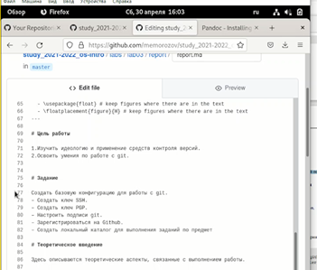
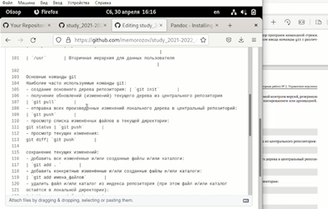
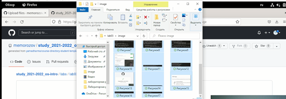
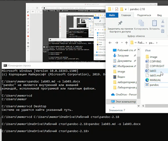
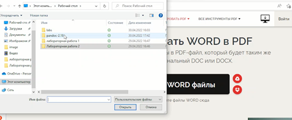

---
## Front matter
title: "Отчёт по лабораторной работе 3"
subtitle: "Markdown"
author: "Михаил Евгеньевич Морозов"

## Generic otions
lang: ru-RU
toc-title: "Содержание"

## Bibliography
bibliography: bib/cite.bib
csl: pandoc/csl/gost-r-7-0-5-2008-numeric.csl

## Pdf output format
toc: true # Table of contents
toc-depth: 2
lof: true # List of figures
lot: true # List of tables
fontsize: 12pt
linestretch: 1.5
papersize: a4
documentclass: scrreprt
## I18n polyglossia
polyglossia-lang:
  name: russian
  options:
	- spelling=modern
	- babelshorthands=true
polyglossia-otherlangs:
  name: english
## I18n babel
babel-lang: russian
babel-otherlangs: english
## Fonts
mainfont: PT Serif
romanfont: PT Serif
sansfont: PT Sans
monofont: PT Mono
mainfontoptions: Ligatures=TeX
romanfontoptions: Ligatures=TeX
sansfontoptions: Ligatures=TeX,Scale=MatchLowercase
monofontoptions: Scale=MatchLowercase,Scale=0.9
## Biblatex
biblatex: true
biblio-style: "gost-numeric"
biblatexoptions:
  - parentracker=true
  - backend=biber
  - hyperref=auto
  - language=auto
  - autolang=other*
  - citestyle=gost-numeric
## Pandoc-crossref LaTeX customization
figureTitle: "Рис."
tableTitle: "Таблица"
listingTitle: "Листинг"
lofTitle: "Список иллюстраций"
lotTitle: "Список таблиц"
lolTitle: "Листинги"
## Misc options
indent: true
header-includes:
  - \usepackage{indentfirst}
  - \usepackage{float} # keep figures where there are in the text
  - \floatplacement{figure}{H} # keep figures where there are in the text
---

# Цель работы
Научиться оформлять отчёты с помощью легковесного языка разметки Markdown.

# Задание

Сделайте отчёт по предыдущей лабораторной работе в формате Markdown.

В качестве отчёта просьба предоставить отчёты в 3 форматах: pdf, docx и md (в архиве,
поскольку он должен содержать скриншоты, Makefile и т.д.)

# Теоретическое введение

Оформление отчета по лабораторной работе

Лабораторная работа является небольшой научно-исследовательской работой, которую
и оформлять следует по всем утверждённым требованиям. При подготовке отчета по лабораторной работе вы освоите ряд важных элементов, которые в дальнейшем пригодятся
вам при написании курсовой и дипломной работы

Структура отчёта :

Согласно ГОСТ 7.32-2001, любая научно-исследовательская работа должна обязательно
содержать следующие элементы:
– титульный лист;
– реферат;
– введение;
– основную часть;
– заключение.

Также ГОСТ рекомендует включить в работу и такие элементы:
– список исполнителей;
– содержание;
– нормативные ссылки;
– определения;
– обозначения и сокращения;
– список использованных источников;
– приложения.

Если вы проводите сложную работу, выполняемую в несколько этапов, то вам может
понадобиться включить в работу часть или все элементы второго списка

# Выполнение лабораторной работы

После изучения теоретического материала описанногов мтеодическом материале , я приступил к выполнению лабораторной работы номер 3 , для того чтобы её выполнить я решил что самым лучшим , простым и быстрым решением будет изменять шаблон отчета , который был загружен в наш рабочий репозиторий ранее.
Далее я открываю свой отчёт по лабораторной работе номер 2 и начинаю изменять шаблон.

Я меняю цель работы , задание , а также начинаю заполнять раздел выполнение лабораторной работы.

{ #fig:001 width=70% }

Также я заполнил теоретическое введение и вывод.

{ #fig:002 width=70% }

После этого я загружаю все скриншоты , которые буду использовать в своей лабораторной работе , на GitHub в отдельную папку image.

{ #fig:003 width=70% }

После проверки работоспособности отчета на сайте я копирую его содержимое в блокнот и сохраняю текстовый файл с расширением md для дальнейшей работы с ним . Я утсанавливаю pandoc для того чтобы из файла с расширением .md получить .docx , а в дальнейшем и формат .pdf
С помощью команд описаных в методическом материале я конвертирую файл из md в docx и у меня появляется файл в моей папке с другим расширением

{ #fig:004 width=70% }

Перевожу файл формата docx в  pdf с помощью online конвертера файлов.

{ #fig:005 width=70% }

# Выводы
Я научился оформлять отчёты с помощью легковесного языка разметки Markdown.

# Список литературы{.unnumbered}

::: {#refs}
:::
