---
## Front matter
title: "Отчёт по лабораторной работе 2"
subtitle: "Управление версиями"
author: "Михаил Евгеньевич Морозов"

## Generic otions
lang: ru-RU
toc-title: "Содержание"

## Bibliography
bibliography: bib/cite.bib
csl: pandoc/csl/gost-r-7-0-5-2008-numeric.csl

## Pdf output format
toc: true # Table of contents
toc-depth: 2
lof: true # List of figures
lot: true # List of tables
fontsize: 12pt
linestretch: 1.5
papersize: a4
documentclass: scrreprt
## I18n polyglossia
polyglossia-lang:
  name: russian
  options:
	- spelling=modern
	- babelshorthands=true
polyglossia-otherlangs:
  name: english
## I18n babel
babel-lang: russian
babel-otherlangs: english
## Fonts
mainfont: PT Serif
romanfont: PT Serif
sansfont: PT Sans
monofont: PT Mono
mainfontoptions: Ligatures=TeX
romanfontoptions: Ligatures=TeX
sansfontoptions: Ligatures=TeX,Scale=MatchLowercase
monofontoptions: Scale=MatchLowercase,Scale=0.9
## Biblatex
biblatex: true
biblio-style: "gost-numeric"
biblatexoptions:
  - parentracker=true
  - backend=biber
  - hyperref=auto
  - language=auto
  - autolang=other*
  - citestyle=gost-numeric
## Pandoc-crossref LaTeX customization
figureTitle: "Рис."
tableTitle: "Таблица"
listingTitle: "Листинг"
lofTitle: "Список иллюстраций"
lotTitle: "Список таблиц"
lolTitle: "Листинги"
## Misc options
indent: true
header-includes:
  - \usepackage{indentfirst}
  - \usepackage{float} # keep figures where there are in the text
  - \floatplacement{figure}{H} # keep figures where there are in the text
---

# Цель работы

1.Изучить идеологию и применение средств контроля версий. 

2.Освоить умения по работе с git.

# Задание

– Создать базовую конфигурацию для работы с git.

– Создать ключ SSH.

– Создать ключ PGP.

– Настроить подписи git.

– Зарегистрироваться на Github.

– Создать локальный каталог для выполнения заданий по предмет

# Теоретическое введение

Основные команды git

Наиболее часто используемые команды git:
– создание основного дерева репозитория: 
| `git init`       | 

– получение обновлений (изменений) текущего дерева из центрального репозитория
| `git pull`       | 

– отправка всех произведённых изменений локального дерева в центральный репозиторий:
| `git push`       | 

– просмотр списка изменённых файлов в текущей директории:
| `git status `       | 

– просмотр текущих изменения:
| `git diff`       | 

сохранение текущих изменений:
– добавить все изменённые и/или созданные файлы и/или каталоги:
| `git add . `       | 

– добавить конкретные изменённые и/или созданные файлы и/или каталоги:
| `git add имена_файлов`       | 

– удалить файл и/или каталог из индекса репозитория (при этом файл и/или каталог
остаётся в локальной директории):
| `git rm имена_файлов`       | 

сохранение добавленных изменений:
– сохранить все добавленные изменения и все изменённые файлы:
| `git commit -am 'Описание коммита'`       | 

– сохранить добавленные изменения с внесением комментария через встроенный
редактор:
| `git commit`       | 

создание новой ветки, базирующейся на текущей:
| `git checkout -b имя_ветки`    | 

– переключение на некоторую ветку:
| `git checkout имя_ветки`       | 
(при переключении на ветку, которой ещё нет в локальном репозитории, она будет
создана и связана с удалённой)

– отправка изменений конкретной ветки в центральный репозиторий:
| `git push origin имя_ветки`       | 

– слияние ветки с текущим деревом:
| `git merge --no-ff имя_ветки`     | 

удаление ветки:
– удаление локальной уже слитой с основным деревом ветки:
| `git branch -d имя_ветки`       | 

– принудительное удаление локальной ветки:
| `git branch -D имя_ветки `      | 

– удаление ветки с центрального репозитория:
| `git push origin :имя_ветки`    | 

# Выполнение лабораторной работы
1.

Системы контроля версий (Version Control System, VCS) применяются при работе нескольких человек над одним проектом. Обычно основное дерево проекта хранится в локальном или удалённом репозитории, к которому настроен доступ для участников проекта. При внесении изменений в содержание проекта система контроля версий позволяет их фиксировать, совмещать изменения, произведённые разными участниками проекта, производить откат к любой более ранней версии проекта, если это требуется. В классических системах контроля версий используется централизованная модель, предполагающая наличие единого репозитория для хранения файлов. Выполнение большинства функций по управлению версиями осуществляется специальным сервером. Участник проекта (пользователь) перед началом работы посредством определённых команд получает нужную ему версию файлов. После внесения изменений, пользователь размещает новую версию в хранилище. При этом предыдущие версии не удаляются из центрального хранилища и к ним можно вернуться в любой момент. Сервер может сохранять не полную версию изменённых файлов, а производить так называемую дельтакомпрессию — сохранять только изменения между последовательными версиями, что позволяет уменьшить объём хранимых данных. Системы контроля версий поддерживают возможность отслеживания и разрешения конфликтов, которые могут возникнуть при работе нескольких человек над одним файлом. Можно объединить (слить) изменения, сделанные разными участниками (автоматически или вручную), вручную выбрать нужную версию, отменить изменения вовсе или заблокировать файлы для изменения. В зависимости от настроек блокировка не позволяет другим пользователям получить рабочую копию или препятствует изменению рабочей копии файла средствами файловой системы ОС, обеспечивая таким образом, привилегированный доступ только одному пользователю, работающему с файлом. Системы контроля версий также могут обеспечивать дополнительные, более гибкие функциональные возможности. Например, они могут поддерживать работу с несколькими версиями одного файла, сохраняя общую историю изменений до точки ветвления версий и собственные истории изменений каждой ветви. Кроме того, обычно доступна информация о том, кто из участников, когда и какие изменения вносил. Обычно такого рода информация хранится в журнале изменений, доступ к которому можно ограничить. В отличие от классических, в распределённых системах контроля версий центральный репозиторий не является обязательным. Среди классических VCS наиболее известны CVS, Subversion, а среди распределённых — Git, Bazaar, Mercurial. Принципы их работы схожи, отличаются они в основном синтаксисом используемых в работе команд.
После ознакомления с методическим материалом и анализа прочитанного текста немного понимаешь идеологию и применение средств контроля версий.

2.

1)Установка git-flow в Fedora Linux с помощью команд терминала
(последующие скринoшоты из видео выполнения лабораторной работы)

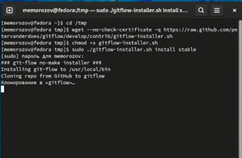
{ #fig:001 width=70% }

2)После ввода команд в терминал начинается выполнения скрипта , устанавливаем gh в Fedora Linux для дальнейшей работы 

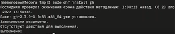
{ #fig:002 width=70% }

3)Далее переходим к базовой настройке git

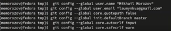
{ #fig:003 width=70% }

4-5)Генерируем ключ ssh

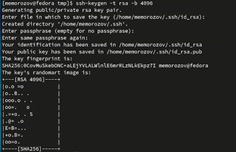
{ #fig:004 width=70% }

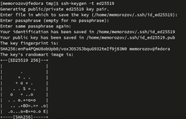
{ #fig:005 width=70% }

6-7-8)Переходим к созданию pgp ключей по формату согласно методическим материалам (RSA,4096,never/name,mail)

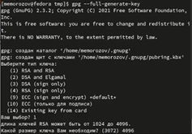
{ #fig:006 width=70% }

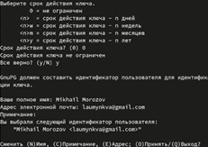
{ #fig:007 width=70% }

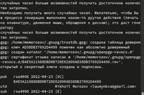
{ #fig:008 width=70% }

9-10)Связываем PGP ключ и свой аккаунт GitHUb

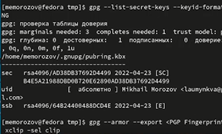
{ #fig:009 width=70% }

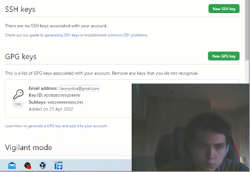
{ #fig:0010 width=70% }

11)Настройка автоматических подписей коммитов git

{ #fig:0011 width=70% }

12-13)Настройка gh и авторизация GitHub через браузер

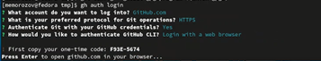
{ #fig:0012 width=70% }

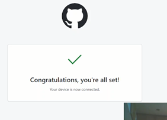
{ #fig:0013 width=70% }

14-15)Генерация SSH ключа и подключение этого ключа к своему аккаунту GitHub

{ #fig:0014 width=70% }

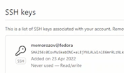
{ #fig:0015 width=70% }

16)Производим настройку репозитория всего курса с помощью команд описаных в методическом материале 

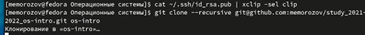
{ #fig:0016 width=70% }

17)Настраиваем каталог круса

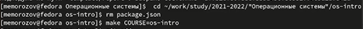
{ #fig:0017 width=70% }

# Выводы

Я изучил идеологию и применение средств контроля версий. А также приобрел умения по работе с git.

# Список литературы{.unnumbered}

::: {#refs}
:::
