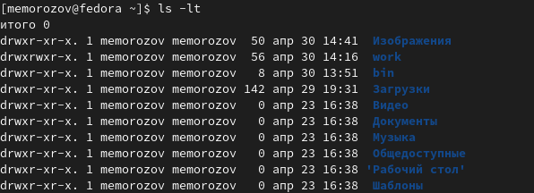

---
## Front matter
title: "Отчёт по лабораторной работе 4"
subtitle: "Основы интерфейса взаимодействия пользователя с системой Unix на уровне командной строки"
author: "Михаил Евгеньевич Морозов"

## Generic otions
lang: ru-RU
toc-title: "Содержание"

## Bibliography
bibliography: bib/cite.bib
csl: pandoc/csl/gost-r-7-0-5-2008-numeric.csl

## Pdf output format
toc: true # Table of contents
toc-depth: 2
lof: true # List of figures
lot: true # List of tables
fontsize: 12pt
linestretch: 1.5
papersize: a4
documentclass: scrreprt
## I18n polyglossia
polyglossia-lang:
  name: russian
  options:
	- spelling=modern
	- babelshorthands=true
polyglossia-otherlangs:
  name: english
## I18n babel
babel-lang: russian
babel-otherlangs: english
## Fonts
mainfont: PT Serif
romanfont: PT Serif
sansfont: PT Sans
monofont: PT Mono
mainfontoptions: Ligatures=TeX
romanfontoptions: Ligatures=TeX
sansfontoptions: Ligatures=TeX,Scale=MatchLowercase
monofontoptions: Scale=MatchLowercase,Scale=0.9
## Biblatex
biblatex: true
biblio-style: "gost-numeric"
biblatexoptions:
  - parentracker=true
  - backend=biber
  - hyperref=auto
  - language=auto
  - autolang=other*
  - citestyle=gost-numeric
## Pandoc-crossref LaTeX customization
figureTitle: "Рис."
tableTitle: "Таблица"
listingTitle: "Листинг"
lofTitle: "Список иллюстраций"
lotTitle: "Список таблиц"
lolTitle: "Листинги"
## Misc options
indent: true
header-includes:
  - \usepackage{indentfirst}
  - \usepackage{float} # keep figures where there are in the text
  - \floatplacement{figure}{H} # keep figures where there are in the text
---

# Цель работы

Приобретение практических навыков взаимодействия пользователя с системой по средством командной строки.

# Задание

1. Определите полное имя вашего домашнего каталога. Далее относительно этого каталога будут выполняться последующие упражнения.
2. Выполните следующие действия:
2.1. Перейдите в каталог /tmp.
2.2. Выведите на экран содержимое каталога /tmp. Для этого используйте команду ls
с различными опциями. Поясните разницу в выводимой на экран информации.
2.3. Определите, есть ли в каталоге /var/spool подкаталог с именем cron?
2.4. Перейдите в Ваш домашний каталог и выведите на экран его содержимое. Определите, кто является владельцем файлов и подкаталогов?
3. Выполните следующие действия:
3.1. В домашнем каталоге создайте новый каталог с именем newdir.
3.2. В каталоге ~/newdir создайте новый каталог с именем morefun.
3.3. В домашнем каталоге создайте одной командой три новых каталога с именами
letters, memos, misk. Затем удалите эти каталоги одной командой.
3.4. Попробуйте удалить ранее созданный каталог ~/newdir командой rm. Проверьте,
был ли каталог удалён.
3.5. Удалите каталог ~/newdir/morefun из домашнего каталога. Проверьте, был ли
каталог удалён.
4. С помощью команды man определите, какую опцию команды ls нужно использовать для просмотра содержимое не только указанного каталога, но и подкаталогов,
входящих в него.
5. С помощью команды man определите набор опций команды ls, позволяющий отсортировать по времени последнего изменения выводимый список содержимого каталога
с развёрнутым описанием файлов.
6. Используйте команду man для просмотра описания следующих команд: cd, pwd, mkdir,
rmdir, rm. Поясните основные опции этих команд.
7. Используя информацию, полученную при помощи команды history, выполните модификацию и исполнение нескольких команд из буфера команд

# Теоретическое введение

В операционной системе типа Linux взаимодействие пользователя с системой обычно
осуществляется с помощью командной строки посредством построчного ввода команд. При этом обычно используется командные интерпретаторы языка shell: /bin/sh;
/bin/csh; /bin/ksh.
Формат команды. Командой в операционной системе называется записанный по
специальным правилам текст (возможно с аргументами), представляющий собой указание на выполнение какой-либо функций (или действий) в операционной системе.
Обычно первым словом идёт имя команды, остальной текст — аргументы или опции,
конкретизирующие действие.
Общий формат команд можно представить следующим образом:
<имя_команды><разделитель><аргументы>

# Выполнение лабораторной работы

После того как я ознакомился с методическими материалами , я приступил к выполнению лабораторной работе номер 4
Я определил полное имя своего домашнего каталога с помощью команд cd и pwd 

{ #fig:001 width=70% }

Далее я перешел в каталог  /tmp с помощбю команды cd и вывел на экран содержимое каталога с помощью команды ls и различных опций 

{ #fig:002 width=70% }

{ #fig:003 width=70% }

{ #fig:004 width=70% }

{ #fig:005 width=70% }

{ #fig:006 width=70% }

Далее я определял существует ли в каталоге /var/spool подкаталог с именем cron

{ #fig:007 width=70% }

После этого я перешел к своему домашнему каталогу и посмотрел содержимое своего домашнего каталога , а также по ответу команды определил кто является владельцем файлов и подкаталогов соответственно

{ #fig:008 wdth=70% }

После этого я перешел в домашний каталог и создал новый каталог с именем newdir в только , что созданном каталоге создал новый каталог с именем morefun и проверял полные пути с помощью команды  pwd

{ #fig:009 width=70% }

После этого шага я создал одной командой 3 новых каталога одной командой в своем домашнем каталоге и удалил их , при помощи одной команды 

{ #fig:0010 width=70% }

Затем я выполнял шаг по удалению каталогов которые только что создал и проверял их с помощью команды ls

{ #fig:0011 width=70% }

С помощью команды man я узнал информацию о опциях команды ls и нашел нужную опцию команды для просмотра не только каталога, но  и его подкаталогов.

{ #fig:0016 width=70% }

С помощью команды man я узнал информацию о опцияз ls и для следующего задания 

{ #fig:0012 width=70% }

Также с помощью команды man я узнал информацию о всех опциях нужных ме команд по средствам последовательного использования этих команд в терминале это выглядело так 

{ #fig:0013 width=70% }

Далее с помощью команды  history я посмотрел журнал команд использованых ранее и применил модификацию к одной из команд и использоал её ещё раз. 

{ #fig:0014 width=70% }

{ #fig:0015 width=70% }

# Выводы

Я приобрел практические навыки взаимодействия пользователя с системой по средствам использования команд терминала.

# Список литературы{.unnumbered}

::: {#refs}
:::
