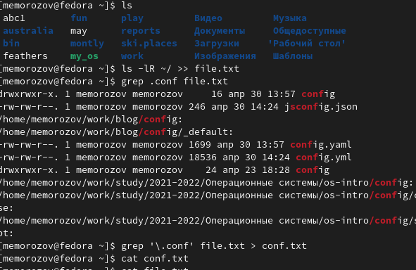
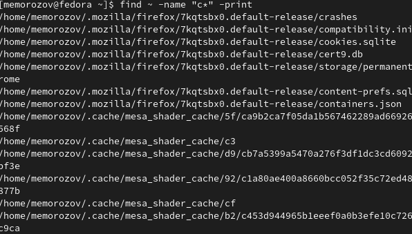
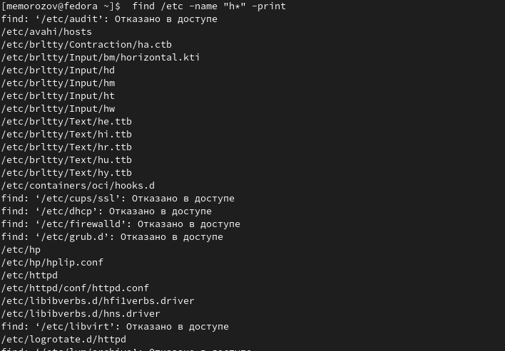
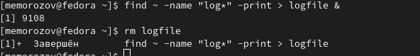
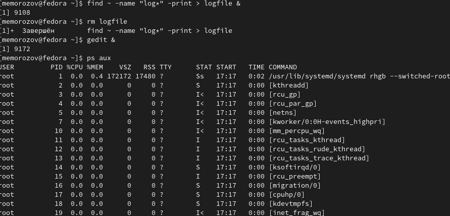
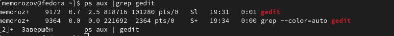
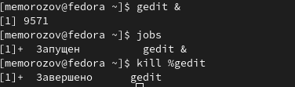
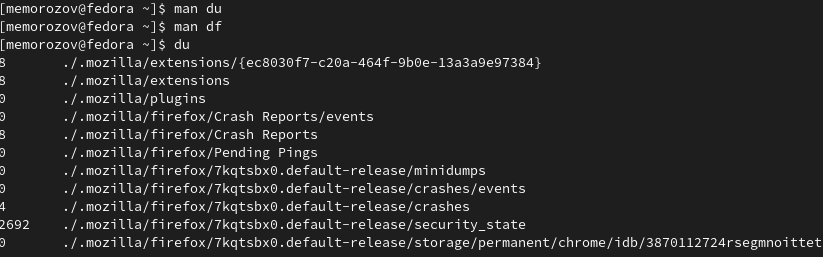
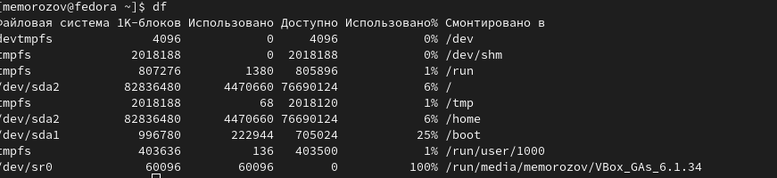
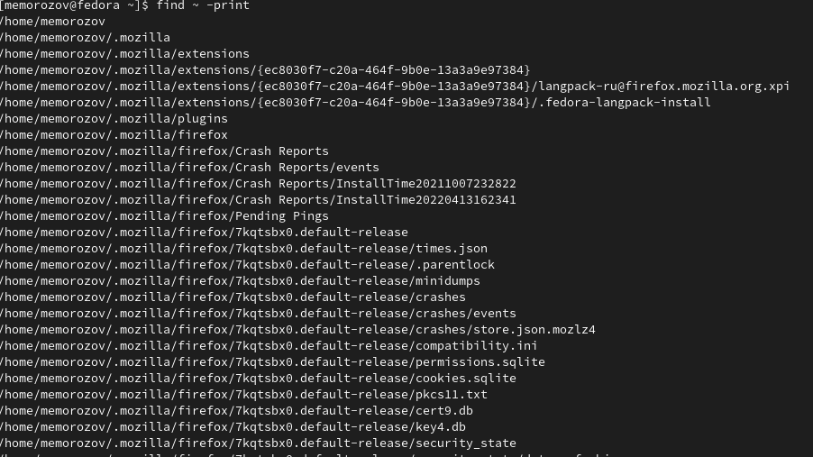

---
## Front matter
title: "Отчёт по лабораторной работе 5"
subtitle: "Анализ файловой структуры UNIX. Команды для работы с файлами и каталогами"
author: "Михаил Евгеньевич Морозов"

## Generic otions
lang: ru-RU
toc-title: "Содержание"

## Bibliography
bibliography: bib/cite.bib
csl: pandoc/csl/gost-r-7-0-5-2008-numeric.csl

## Pdf output format
toc: true # Table of contents
toc-depth: 2
lof: true # List of figures
lot: true # List of tables
fontsize: 12pt
linestretch: 1.5
papersize: a4
documentclass: scrreprt
## I18n polyglossia
polyglossia-lang:
  name: russian
  options:
	- spelling=modern
	- babelshorthands=true
polyglossia-otherlangs:
  name: english
## I18n babel
babel-lang: russian
babel-otherlangs: english
## Fonts
mainfont: PT Serif
romanfont: PT Serif
sansfont: PT Sans
monofont: PT Mono
mainfontoptions: Ligatures=TeX
romanfontoptions: Ligatures=TeX
sansfontoptions: Ligatures=TeX,Scale=MatchLowercase
monofontoptions: Scale=MatchLowercase,Scale=0.9
## Biblatex
biblatex: true
biblio-style: "gost-numeric"
biblatexoptions:
  - parentracker=true
  - backend=biber
  - hyperref=auto
  - language=auto
  - autolang=other*
  - citestyle=gost-numeric
## Pandoc-crossref LaTeX customization
figureTitle: "Рис."
tableTitle: "Таблица"
listingTitle: "Листинг"
lofTitle: "Список иллюстраций"
lotTitle: "Список таблиц"
lolTitle: "Листинги"
## Misc options
indent: true
header-includes:
  - \usepackage{indentfirst}
  - \usepackage{float} # keep figures where there are in the text
  - \floatplacement{figure}{H} # keep figures where there are in the text
---

# Цель работы

Ознакомление с файловой системой Linux, её структурой, именами и содержанием
каталогов. Приобретение практических навыков по применению команд для работы
с файлами и каталогами, по управлению процессами (и работами), по проверке использования диска и обслуживанию файловой системы.

# Задание

Последовательность выполнения работы
1. Выполните все примеры, приведённые в первой части описания лабораторной работы.
2. Выполните следующие действия, зафиксировав в отчёте по лабораторной работе
используемые при этом команды и результаты их выполнения:
2.1. Скопируйте файл /usr/include/sys/io.h в домашний каталог и назовите его
equipment. Если файла io.h нет, то используйте любой другой файл в каталоге
/usr/include/sys/ вместо него.
2.2. В домашнем каталоге создайте директорию ~/ski.plases.
2.3. Переместите файл equipment в каталог ~/ski.plases.
2.4. Переименуйте файл ~/ski.plases/equipment в ~/ski.plases/equiplist.
2.5. Создайте в домашнем каталоге файл abc1 и скопируйте его в каталог
~/ski.plases, назовите его equiplist2.
2.6. Создайте каталог с именем equipment в каталоге ~/ski.plases.
2.7. Переместите файлы ~/ski.plases/equiplist и equiplist2 в каталог
~/ski.plases/equipment.
2.8. Создайте и переместите каталог ~/newdir в каталог ~/ski.plases и назовите
его plans.
3. Определите опции команды chmod, необходимые для того, чтобы присвоить перечисленным ниже файлам выделенные права доступа, считая, что в начале таких прав
нет:
3.1. drwxr--r-- ... australia
3.2. drwx--x--x ... play
3.3. -r-xr--r-- ... my_os
3.4. -rw-rw-r-- ... feathers
При необходимости создайте нужные файлы.
4. Проделайте приведённые ниже упражнения, записывая в отчёт по лабораторной
работе используемые при этом команды:
4.1. Просмотрите содержимое файла /etc/password.
4.2. Скопируйте файл ~/feathers в файл ~/file.old.
4.3. Переместите файл ~/file.old в каталог ~/play.
4.4. Скопируйте каталог ~/play в каталог ~/fun.
4.5. Переместите каталог ~/fun в каталог ~/play и назовите его games.
4.6. Лишите владельца файла ~/feathers права на чтение.
4.7. Что произойдёт, если вы попытаетесь просмотреть файл ~/feathers командой
cat?
4.8. Что произойдёт, если вы попытаетесь скопировать файл ~/feathers?
4.9. Дайте владельцу файла ~/feathers право на чтение.
4.10. Лишите владельца каталога ~/play права на выполнение.
4.11. Перейдите в каталог ~/play. Что произошло?
4.12. Дайте владельцу каталога ~/play право на выполнение.
5. Прочитайте man по командам mount, fsck, mkfs, kill и кратко их охарактеризуйте,
приведя примеры.

# Теоретическое введение

Команды для работы с файлами и каталогами
Для создания текстового файла можно использовать команду touch.
Формат команды:
touch имя-файла
Для просмотра файлов небольшого размера можно использовать команду cat.
Формат команды:
cat имя-файла
Для просмотра файлов постранично удобнее использовать команду less.
Формат команды:
less имя-файла
Следующие клавиши используются для управления процессом просмотра:
– Space — переход к следующей странице,
– ENTER — сдвиг вперёд на одну строку,
– b — возврат на предыдущую страницу,
– h — обращение за подсказкой,
– q — выход из режима просмотра файла.
Команда head выводит по умолчанию первые 10 строк файла.
Формат команды:
head [-n] имя-файла,
где n — количество выводимых строк.
Команда tail выводит умолчанию 10 последних строк файла.
Формат команды:
tail [-n] имя-файла,
где n — количество выводимых строк.

Копирование файлов и каталогов
Команда cp используется для копирования файлов и каталогов.
Формат команды:
cp [-опции] исходный_файл целевой_файл
Примеры:

1. Копирование файла в текущем каталоге. Скопировать файл ~/abc1 в файл april
и в файл may:
cd
touch abc1
cp abc1 april
cp abc1 may

2. Копирование нескольких файлов в каталог. Скопировать файлы april и may в каталог
monthly:
mkdir monthly
cp april may monthly

3. Копирование файлов в произвольном каталоге.Скопировать файл monthly/may в файл
с именем june:
cp monthly/may monthly/june
ls monthly
Опция i в команде cp выведет на экран запрос подтверждения о перезаписи файла.
Для рекурсивного копирования каталогов, содержащих файлы, используется команда
cp с опцией r.

Перемещение и переименование файлов и каталогов
Команды mv и mvdir предназначены для перемещения и переименования файлов
и каталогов.
Формат команды mv:
mv [-опции] старый_файл новый_файл

Права доступа
Каждый файл или каталог имеет права доступа (табл. 5.1).
В сведениях о файле или каталоге указываются:
– тип файла (символ (-) обозначает файл, а символ (d) — каталог);
– права для владельца файла (r — разрешено чтение, w — разрешена запись, x — разрешено выполнение, - — право доступа отсутствует);
– права для членов группы (r — разрешено чтение, w — разрешена запись, x — разрешено
выполнение, - — право доступа отсутствует);
– права для всех остальных (r — разрешено чтение, w — разрешена запись, x — разрешено
выполнение, - — право доступа отсутствует).

Изменение прав доступа
Права доступа к файлу или каталогу можно изменить, воспользовавшись командой
chmod. Сделать это может владелец файла (или каталога) или пользователь с правами
администратора.
Формат команды:
chmod режим имя_файла
Режим (в формате команды) имеет следующие компоненты структуры и способ записи:
= установить право
- лишить права
+ дать право
r чтение
w запись
x выполнение
u (user) владелец файла
g (group) группа, к которой принадлежит владелец файла
o (others) все остальные
В работе с правами доступа можно использовать их цифровую запись (восьмеричное
значение) вместо символьной.

Анализ файловой системы
Файловая система в Linux состоит из фалов и каталогов. Каждому физическому носителю соответствует своя файловая система.
Существует несколько типов файловых систем. Перечислим наиболее часто встречающиеся типы:
– ext2fs (second extended filesystem);
– ext2fs (third extended file system);
– ext4 (fourth extended file system);
– ReiserFS;
– xfs;
– fat (file allocation table);
– ntfs (new technology file system).

# Выполнение лабораторной работы

1.Я последовательно выполнил все примеры описаные в первой части методического материала.

{ #fig:001 width=70% }

{ #fig:002 width=70% }

{ #fig:003 width=70% }

{ #fig:004 width=70% }

{ #fig:005 width=70% }

{ #fig:006 width=70% }

{ #fig:007 width=70% }

{ #fig:008 wdth=70% }

{ #fig:009 width=70% }

{ #fig:0010 width=70% }

2.Далее я приступил к последовательному выполнению второго шага лабораторной работы скопировал файл io.h в домашний каталог , в домашнем каталоге создал директорию ski.places ,
переместил файл equipment в эту директорию , затем переименовал этот файл в equiplist , далее создал файл abc1 , скопировал его и переименовал в equiplist2 и переместил оба этих файла в каталог equipment , создал и переместил каталог newdir и переименовал его в plans.

{ #fig:0011 width=70% }

{ #fig:0012 width=70% }

{ #fig:0013 width=70% }

{ #fig:0014 width=70% }

{ #fig:0015 width=70% }

{ #fig:0016 width=70% }

{ #fig:0017 width=70% }

{ #fig:0018 width=70% }

3.Далее создал 2 каталога и 2 файла и с помощью опций команды chmod присвоил необходимые права доступа к файлам.

{ #fig:0019 width=70% }

{ #fig:0020 width=70% }

{ #fig:0021 width=70% }

{ #fig:0022 width=70% }

{ #fig:0023 width=70% }

{ #fig:0024 width=70% }

4.Далее посмотрел содержимое файла /etc/paswd , скопровал файл feathers в file.old переместил файл в каталог play скопировал каталог play в каталог fun , перименовал его в games далее начал произоводить манипуляции с правами доступа к файлу лишал владельца права на чтения и пытался просмотреть и скопировать , далее возвращал эти права и лишнал права на выполнение и пытался перейти к этому каталогу , после этих манипуляций возврщал все права доступа.

{ #fig:0026 width=70% }

{ #fig:0027 width=70% }

{ #fig:0028 width=70% }

{ #fig:0029 width=70% }

{ #fig:0030 width=70% }

{ #fig:0031 width=70% }

{ #fig:0032 width=70% }

5.С помощью команды man изучил документацию по командам mount,mkfs,kill.

{ #fig:0025 width=70% }

# Выводы

Я ознакомился с файловой системой Linux, её структурой, именами и содержанием
каталогов. Приобрёл практические навыки по применению команд для работы
с файлами и каталогами, по управлению процессами (и работами), по проверке использования диска и обслуживанию файловой системы.

# Список литературы{.unnumbered}

::: {#refs}
:::
