---
## Front matter
title: "Отчёт по лабораторной работе 7"
subtitle: " Командная оболочка Midnight
Commander"
author: "Михаил Евгеньевич Морозов"

## Generic otions
lang: ru-RU
toc-title: "Содержание"

## Bibliography
bibliography: bib/cite.bib
csl: pandoc/csl/gost-r-7-0-5-2008-numeric.csl

## Pdf output format
toc: true # Table of contents
toc-depth: 2
lof: true # List of figures
lot: true # List of tables
fontsize: 12pt
linestretch: 1.5
papersize: a4
documentclass: scrreprt
## I18n polyglossia
polyglossia-lang:
  name: russian
  options:
	- spelling=modern
	- babelshorthands=true
polyglossia-otherlangs:
  name: english
## I18n babel
babel-lang: russian
babel-otherlangs: english
## Fonts
mainfont: PT Serif
romanfont: PT Serif
sansfont: PT Sans
monofont: PT Mono
mainfontoptions: Ligatures=TeX
romanfontoptions: Ligatures=TeX
sansfontoptions: Ligatures=TeX,Scale=MatchLowercase
monofontoptions: Scale=MatchLowercase,Scale=0.9
## Biblatex
biblatex: true
biblio-style: "gost-numeric"
biblatexoptions:
  - parentracker=true
  - backend=biber
  - hyperref=auto
  - language=auto
  - autolang=other*
  - citestyle=gost-numeric
## Pandoc-crossref LaTeX customization
figureTitle: "Рис."
tableTitle: "Таблица"
listingTitle: "Листинг"
lofTitle: "Список иллюстраций"
lotTitle: "Список таблиц"
lolTitle: "Листинги"
## Misc options
indent: true
header-includes:
  - \usepackage{indentfirst}
  - \usepackage{float} # keep figures where there are in the text
  - \floatplacement{figure}{H} # keep figures where there are in the text
---

# Цель работы

воение основных возможностей командной оболочки Midnight Commander. Приобретение навыков практической работы по просмотру каталогов и файлов; манипуляций
с ними.

# Задание

Задание по mc
1. Изучите информацию о mc, вызвав в командной строке man mc.
2. Запустите из командной строки mc, изучите его структуру и меню.
3. Выполните несколько операций в mc, используя управляющие клавиши (операции
с панелями; выделение/отмена выделения файлов, копирование/перемещение файлов, получение информации о размере и правах доступа на файлы и/или каталоги
и т.п.)
4. Выполните основные команды меню левой (или правой) панели. Оцените степень
подробности вывода информации о файлах.
5. Используя возможности подменю Файл , выполните:
– просмотр содержимого текстового файла;
– редактирование содержимого текстового файла (без сохранения результатов
редактирования);
– создание каталога;
– копирование в файлов в созданный каталог.
6. С помощью соответствующих средств подменю Команда осуществите:
– поиск в файловой системе файла с заданными условиями (например, файла
с расширением .c или .cpp, содержащего строку main);
– выбор и повторение одной из предыдущих команд;
– переход в домашний каталог;
– анализ файла меню и файла расширений.
7. Вызовите подменю Настройки . Освойте операции, определяющие структуру экрана mc
(Full screen, Double Width, Show Hidden Files и т.д.)

Задание по встроенному редактору mc
1. Создайте текстовой файл text.txt.
2. Откройте этот файл с помощью встроенного в mc редактора.
3. Вставьте в открытый файл небольшой фрагмент текста, скопированный из любого
другого файла или Интернета.
4. Проделайте с текстом следующие манипуляции, используя горячие клавиши:
4.1. Удалите строку текста.
4.2. Выделите фрагмент текста и скопируйте его на новую строку.
4.3. Выделите фрагмент текста и перенесите его на новую строку.
4.4. Сохраните файл.
4.5. Отмените последнее действие.
4.6. Перейдите в конец файла (нажав комбинацию клавиш) и напишите некоторый
текст.
4.7. Перейдите в начало файла (нажав комбинацию клавиш) и напишите некоторый
текст.
4.8. Сохраните и закройте файл.
5. Откройте файл с исходным текстом на некотором языке программирования (например C или Java)
6. Используя меню редактора, включите подсветку синтаксиса, если она не включена,
или выключите, если она включена.

# Теоретическое введение

Командная оболочка   — интерфейс взаимодействия пользователя с операционной системой и программным обеспечением посредством команд.
Midnight Commander (или mc) — псевдографическая командная оболочка для UNIX/Linux
систем. Для запуска mc необходимо в командной строке набрать mc и нажать Enter .
Рабочее пространство mc имеет две панели, отображающие по умолчанию списки
файлов двух каталогов.
Над панелями располагается меню, доступ к которому осуществляется с помощью
клавиши F9 . Под панелями внизу расположены управляющие экранные кнопки, ассоциированные с функциональными клавишами F1 – F10 (табл. 7.1). Над ними располагается
командная строка, предназначенная для ввода команд.

Функциональные клавиши mc
F1 Вызов контекстно-зависимой подсказки
F2 Вызов пользовательского меню с возможностью создания и/или дополнения дополнительных функций
F3 Просмотр содержимого файла, на который указывает подсветка в активной панели (без возможности редактирования)
F4 Вызов встроенного в mc редактора для изменения содержания файла,
на который указывает подсветка в активной панели
F5 Копирование одного или нескольких файлов, отмеченных в первой
(активной) панели, в каталог, отображаемый на второй панели
F6 Перенос одного или нескольких файлов, отмеченных в первой (активной) панели, в каталог, отображаемый на второй панели
F7 Создание подкаталога в каталоге, отображаемом в активной панели
F8 Удаление одного или нескольких файлов (каталогов), отмеченных в первой (активной) панели файлов
F9 Вызов меню mc
F10 Выход из mc

# Выполнение лабораторной работы

 # Задание по mc
 Я изучил информацию о mc , вызвав в командной строке информацию о mc с помощью команды man mc.
 

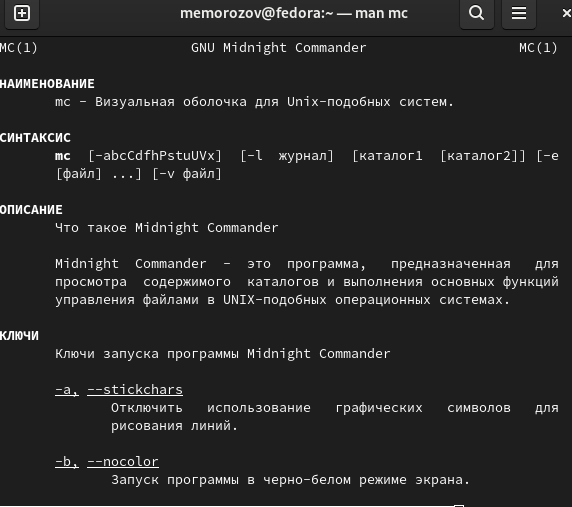
{Скриншот 1 Информация о mc}

Далее вызвал командную оболочку с помощью команды mc  и начал изучать возможности и меню оболочки.

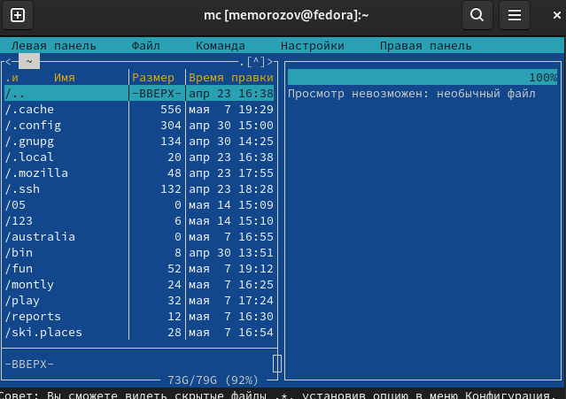
{Скриншот 2 Меню командной оболочки}

После этого начал выполнять задания описаные в методическом материале выделял и отменял выделения файлов 

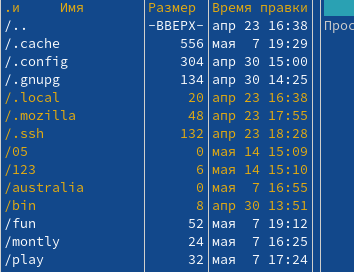
{Скриншот 3 Выделение файлов}

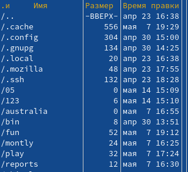
{Скриншот 4 Отмена выделения}

!5](image/5.png)
{ Скриншот 5 Проверял функцию копирования }

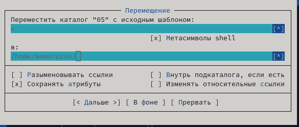
{ Скриншот 6 Проверял функцию перемещения }

После этого начал просмтаривать подробную информацию о каталоге/файле.

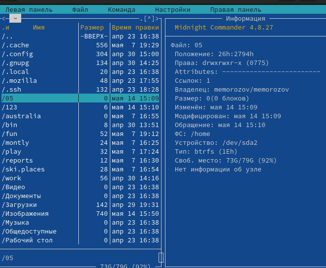
{ Скриншот 7 Просмотр информации о каталоге }

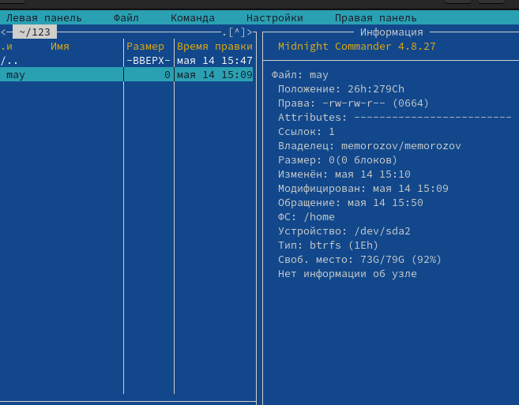
{ Скриншот 8 Просмотр информации о файле }

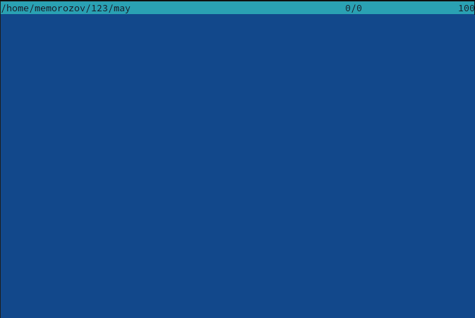
{ Скриншот 9 Просмотр файла }

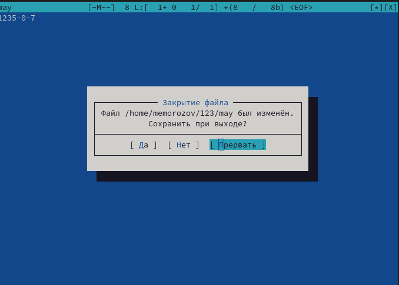
{ Скриншот 10 Правка файла без изменения }

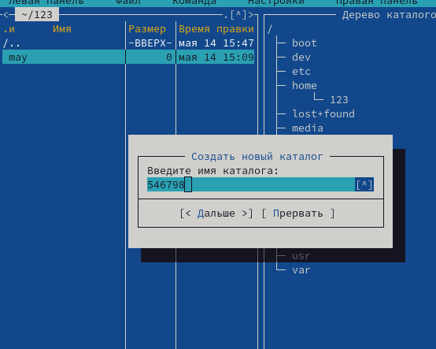
{ Скриншот 11  Создание нового каталога }

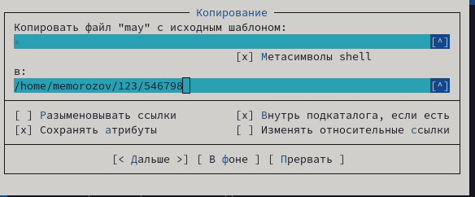
{ Скриншот 12 Копирование файла в созданный каталог }

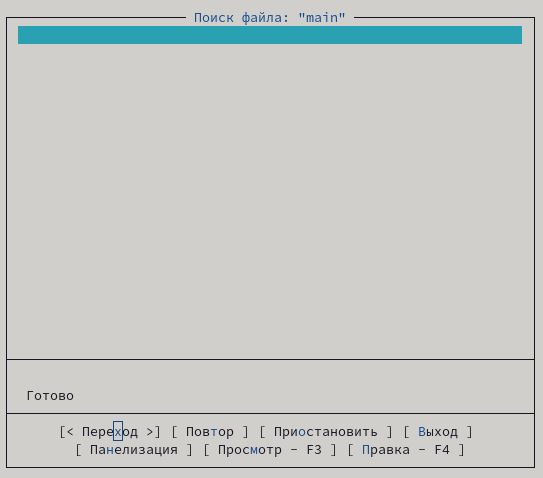
{ Скриншот 13 Проверка функции поиска }

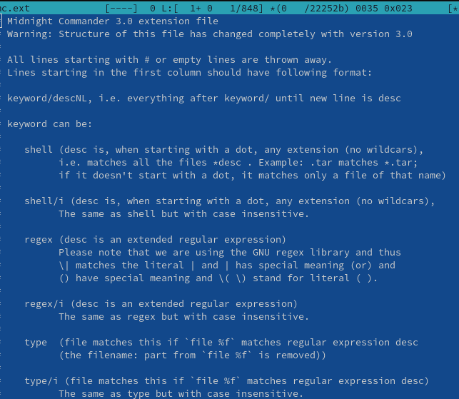
{ Скриншо 14 Просмотр информации о расширении }

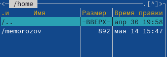
{ Скриншот 15 Переход в домашний каталог }

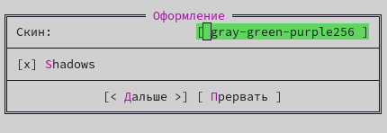
{ Скриншот 16 Изменение конфигурации оформления }

# Задание по встроенному редактору mc

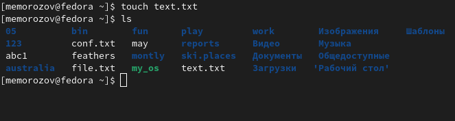
{ Скриншот 17 Создание нового текстового файла для последующего редактирования }

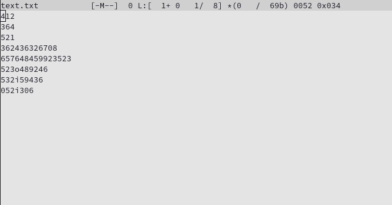
{ Скриншот 18 Редакция текстового файла с целью проверки функций }

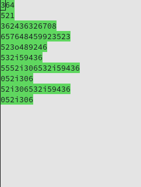
{ Скриншот 19 Удаление первой строчки текста }

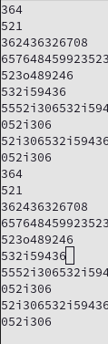
{ Скриншот 20 Перенос фрагмента текста на новую строку }

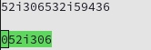
{ Скриншот 21 Перенос фрагмента текста на новую строку }

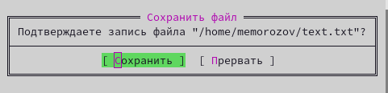
{ Скриншот 22 Cохранение изменений файла }

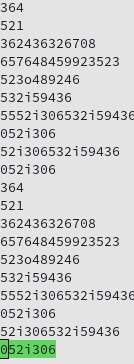
{ Скриншот 23 Отмена последнего действия}

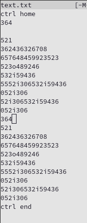
{ Скриншот 24 Перемещения с помощью сочетания клавиш ctrl+home/ctrl+end к началу и концу списка }

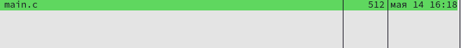
{ Скриншот 25 С помощью сочетания клавиш ctrl+s я переключал выделение синтаксиса }

# Выводы

Я освоил основные возможности командной облочокий Midnight Commander. Приобрел навыки практической работы по просмотру каталогов и файлов и манипуляций с ними.

# Список литературы{.unnumbered}

::: {#refs}
:::
