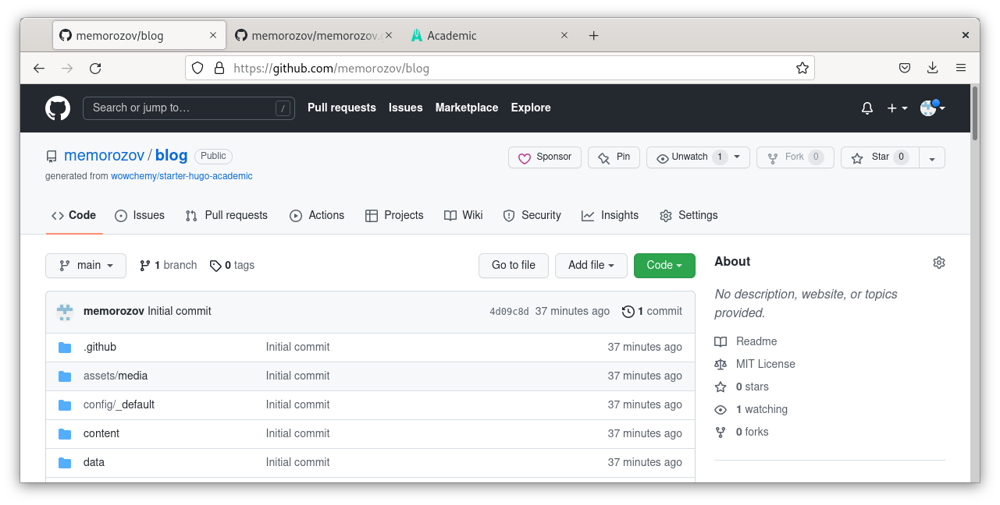

---
## Front matter
title: "Отчёта по индвидуальному проекту"
subtitle: "1 шаг"
author: "Михаил Евгеньевич Морозов"

## Generic otions
lang: ru-RU
toc-title: "Содержание"

## Bibliography
bibliography: bib/cite.bib
csl: pandoc/csl/gost-r-7-0-5-2008-numeric.csl

## Pdf output format
toc: true # Table of contents
toc-depth: 2
lof: true # List of figures
lot: true # List of tables
fontsize: 12pt
linestretch: 1.5
papersize: a4
documentclass: scrreprt
## I18n polyglossia
polyglossia-lang:
  name: russian
  options:
	- spelling=modern
	- babelshorthands=true
polyglossia-otherlangs:
  name: english
## I18n babel
babel-lang: russian
babel-otherlangs: english
## Fonts
mainfont: PT Serif
romanfont: PT Serif
sansfont: PT Sans
monofont: PT Mono
mainfontoptions: Ligatures=TeX
romanfontoptions: Ligatures=TeX
sansfontoptions: Ligatures=TeX,Scale=MatchLowercase
monofontoptions: Scale=MatchLowercase,Scale=0.9
## Biblatex
biblatex: true
biblio-style: "gost-numeric"
biblatexoptions:
  - parentracker=true
  - backend=biber
  - hyperref=auto
  - language=auto
  - autolang=other*
  - citestyle=gost-numeric
## Pandoc-crossref LaTeX customization
figureTitle: "Рис."
tableTitle: "Таблица"
listingTitle: "Листинг"
lofTitle: "Список иллюстраций"
lotTitle: "Список таблиц"
lolTitle: "Листинги"
## Misc options
indent: true
header-includes:
  - \usepackage{indentfirst}
  - \usepackage{float} # keep figures where there are in the text
  - \floatplacement{figure}{H} # keep figures where there are in the text
---

# Цель работы
Создать 2 разных репозитория по шаблону и без
Создать сайт и открыть его для любого пользователя

# Задание

Размещение на Github pages заготовки для персонального сайта.

Установить необходимое программное обеспечение.
Скачать шаблон темы сайта.
Разместить его на хостинге git.
Установить параметр для URLs сайта.
Разместить заготовку сайта на Github pages.

# Теоретическое введение

Для реализации сайта используется генератор статических сайтов Hugo.

Общие файлы для тем Wowchemy:

Репозиторий: https://github.com/wowchemy/wowchemy-hugo-themes

В качестве шаблона индивидуального сайта используется шаблон Hugo Academic Theme.

Демо-сайт: https://academic-demo.netlify.app/
Репозиторий: https://github.com/wowchemy/starter-hugo-academic

# Выполнение лабораторной работы

По шаблону из теоретичского введния создаю новый репозиторий 

{ #fig:001 width=70% }

После этого я выполняю обычные команды git с клонированием своего нового репозитория 

{ #fig:003 width=70% }

Далее перехожу к отдельным настройкам сайта а также устанаваливаю необходимое програмное обспечения дл использования языка go

{ #fig:004 width=70% }

Проверяю версию установленного ПО

{ #fig:005 width=70% }

Далее запускаю сервер и проверяю локальный хост , открывается ли сайт 

{ #fig:006 width=70% }

После этого уже без шаблона из теоретического введния создаю новый репозиторий и провожу такие же команды как и с репозиторием по шаблону 

На скриншоте видны все репозитории которые я создал 

{ #fig:002 width=70% }

{ #fig:007 width=70% }

Перед следующим шагом я редактирую параматер паблик для редакции и провожу следующую следующию команду git и запускаю сервер 

{ #fig:008 wdth=70% }

{ #fig:009 width=70% }

Который находится по ссылке :
memorozov.github.io

# Выводы

Я создал сайт , два репозитория , и открыл свой сайт для любого пользователя

# Список литературы{.unnumbered}

::: {#refs}
:::
